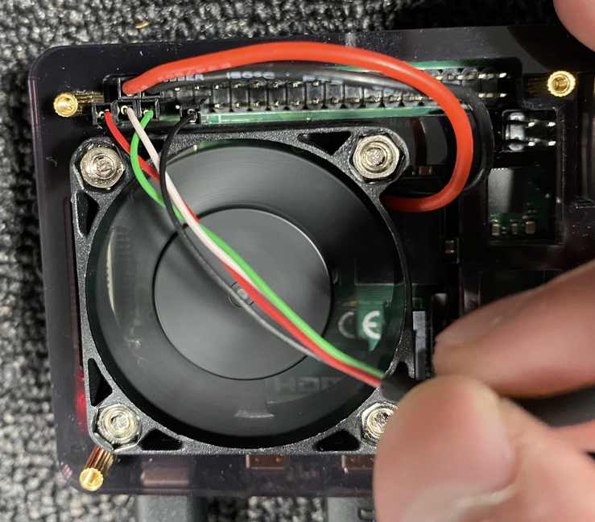

<h1>Hardware Setup:</h1>

- PC: Raspberry Pi4, RAM: 4GB, OS: Raspbian Buster with desktop (Version:February 2020, Release date:2020-02-13, Kernel version:4.19)
- Display: [アイリスオーヤマ 55型 4K対応 液晶 テレビ 55インチ ブラック 55UB10P](https://www.amazon.co.jp/dp/B07RSXQML1/)
- Senosr: [SparkFun Grid-EYE Infrared Array Breakout - AMG8833 (Qwiic)](https://www.sparkfun.com/products/14607)
- Sensor Connection to Pi:
  - Red: 3.3V - GPIO1
  - White: SDA - GPIO3
  - Green: SCL - GPIO5
  - Black: GND - GPIO9



<h1>Key Scripts Details: </h1>
 
- /heat_tracking_ripples/ heat_tracking_ripples.pde - MAIN particles genarator app
- sensor_pos_sender.py - gets grid eye data & send via osc
- /tests/AMG8833(grid eye example)
  - amg8833.py (view heat map)
  - simpletest.py (get sensor data)


# Rippple Scenario Run
## Command
```esc``` for stopping the run.
### Coding Animation
- Onboarding: ```o```
- Drive Start: ```s```
- Drive Stop: ```p```
- Rain: ```r```
### Pre-made Animation
- Payment: ```0```
- Info line: ```1```
- Info line delay: ```2```

## Tips for running the command
- Performance is highly dependent on the machine spec under the environment of showing to 50 inch display (4096 x 2160). 
- If you are switching between scenarios during a single run, the video will become choppy. If this happens, please start the run again and press the command for the scenario you want to show.